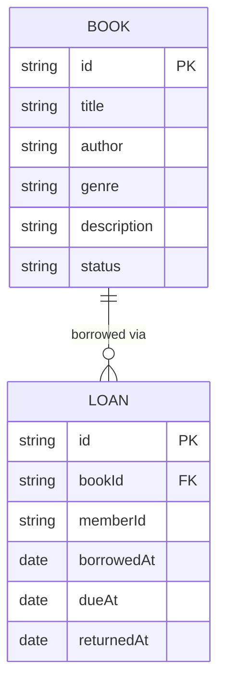

# Domain Model

The library app tracks a catalog of books and the loans members take out
against them; members and librarians are signed-in identities from Thunder,
referenced here only by their user id.

- **Book** — `status` is `available` or `on-loan`; a book on loan cannot be
removed from the catalog.
- **Loan** — `memberId` is the signed-in member's user id from Thunder;
`dueAt` is fixed at `borrowedAt` + two weeks; `returnedAt` is null until the
book is returned. The overdue list librarians see is every loan whose
`dueAt` has passed and `returnedAt` is still null.

