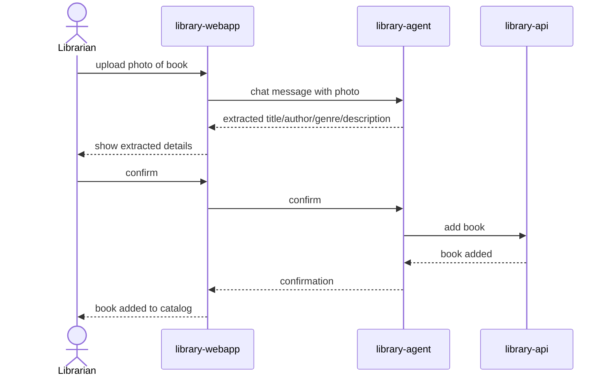

# Add a book by photo

A Librarian uploads a photo of a book; the assistant reads it, extracts the
book's details, and adds it to the catalog once the librarian confirms.

```mermaid
sequenceDiagram
    actor Librarian
    participant webapp as library-webapp
    participant agent as library-agent
    participant api as library-api

    Librarian->>webapp: upload photo of book
    webapp->>agent: chat message with photo
    agent-->>webapp: extracted title/author/genre/description
    webapp-->>Librarian: show extracted details
    Librarian->>webapp: confirm
    webapp->>agent: confirm
    agent->>api: add book
    api-->>agent: book added
    agent-->>webapp: confirmation
    webapp-->>Librarian: book added to catalog
```

