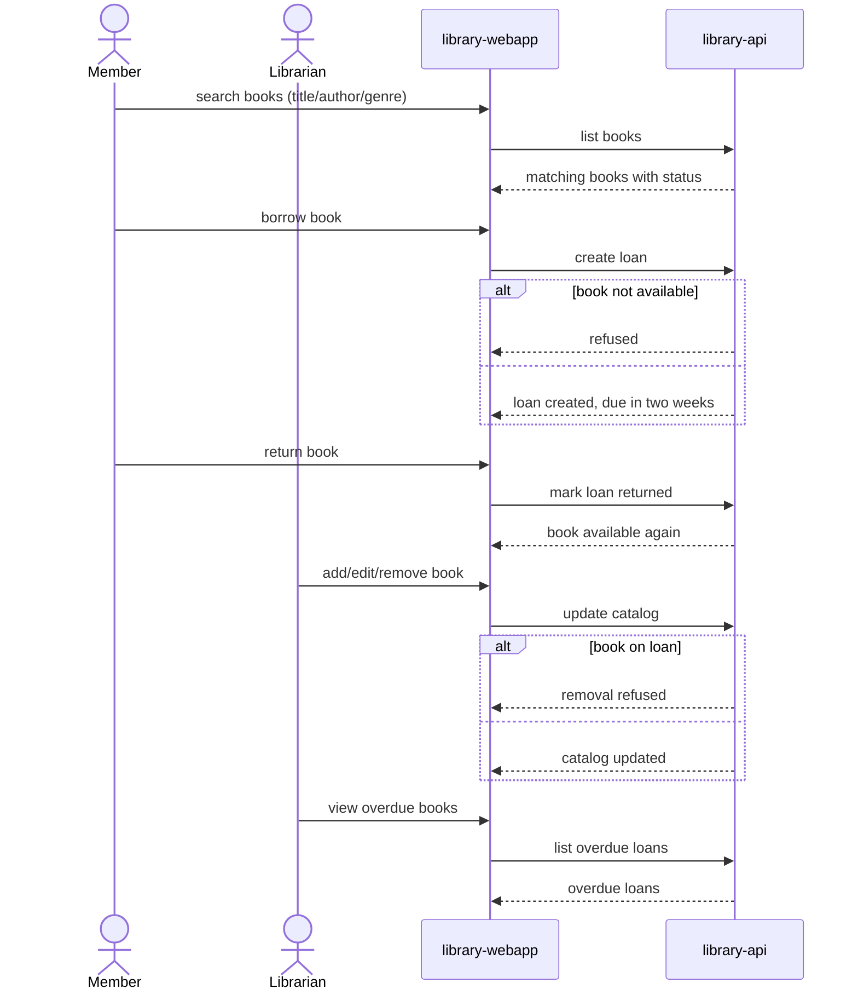

# Borrow and return a book

A Member searches the catalog, borrows an available book for two weeks, and
later returns it; a Librarian keeps the catalog accurate and checks overdue
loans.

```mermaid
sequenceDiagram
    actor Member
    actor Librarian
    participant webapp as library-webapp
    participant api as library-api

    Member->>webapp: search books (title/author/genre)
    webapp->>api: list books
    api-->>webapp: matching books with status
    Member->>webapp: borrow book
    webapp->>api: create loan
    alt book not available
        api-->>webapp: refused
    else
        api-->>webapp: loan created, due in two weeks
    end
    Member->>webapp: return book
    webapp->>api: mark loan returned
    api-->>webapp: book available again

    Librarian->>webapp: add/edit/remove book
    webapp->>api: update catalog
    alt book on loan
        api-->>webapp: removal refused
    else
        api-->>webapp: catalog updated
    end
    Librarian->>webapp: view overdue books
    webapp->>api: list overdue loans
    api-->>webapp: overdue loans
```

