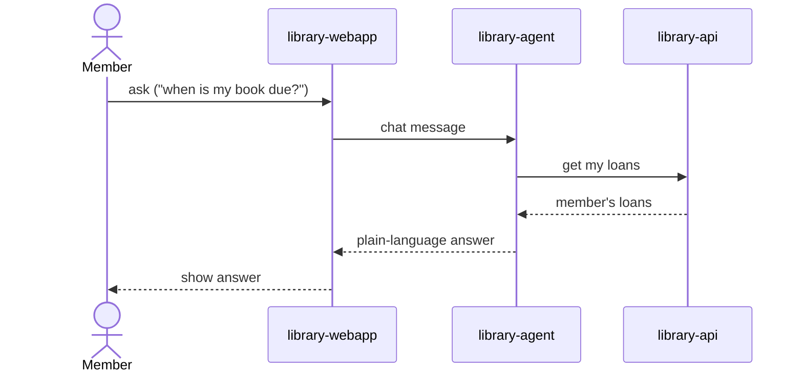

# Plain-language loan questions

A Member asks about their own loans in plain language and gets an answer
drawn from their real loan history.

```mermaid
sequenceDiagram
    actor Member
    participant webapp as library-webapp
    participant agent as library-agent
    participant api as library-api

    Member->>webapp: ask ("when is my book due?")
    webapp->>agent: chat message
    agent->>api: get my loans
    api-->>agent: member's loans
    agent-->>webapp: plain-language answer
    webapp-->>Member: show answer
```

