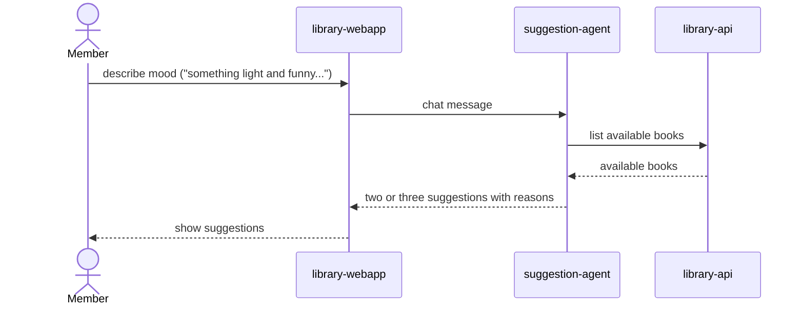

# Mood-based book suggestions

A Member describes what they're in the mood for in their own words and gets a
few suggestions from books currently on the shelf, each with a one-line
reason.

```mermaid
sequenceDiagram
    actor Member
    participant webapp as library-webapp
    participant agent as suggestion-agent
    participant api as library-api

    Member->>webapp: describe mood ("something light and funny...")
    webapp->>agent: chat message
    agent->>api: list available books
    api-->>agent: available books
    agent-->>webapp: two or three suggestions with reasons
    webapp-->>Member: show suggestions
```

